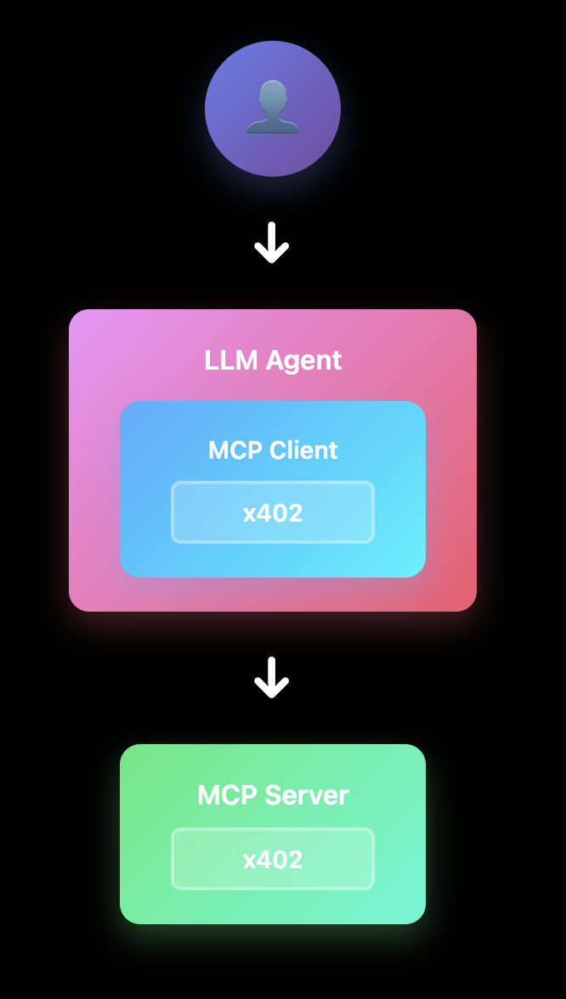
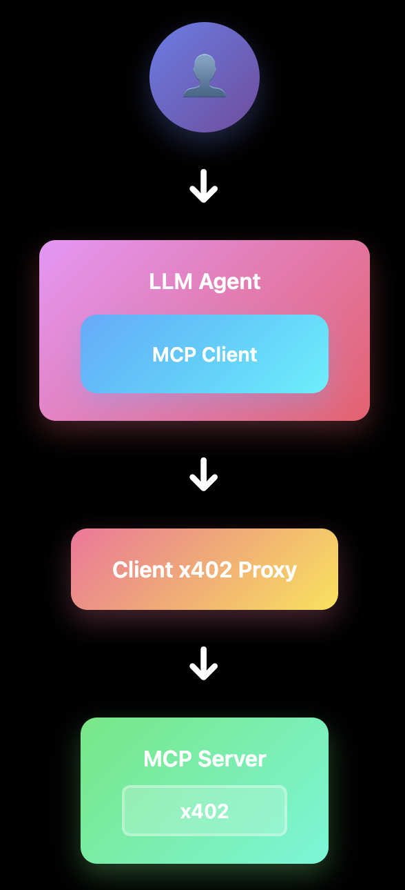
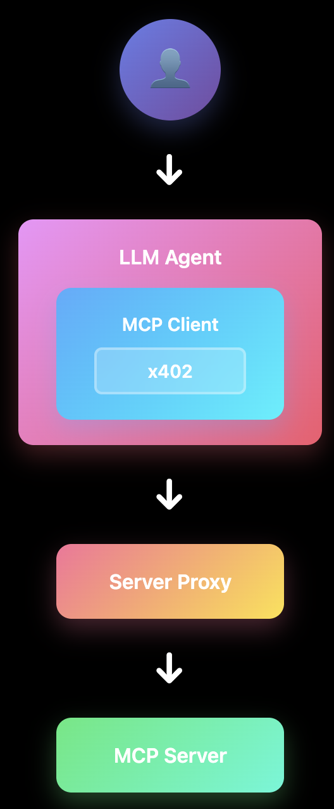

# X402 MCP

A server and client implementation for integrating X402 payment protocol with Model Context Protocol (MCP), enabling micropayments for MCP tool invocations.

## Demo

Try this out with your LLM by adding the following MCP server:

```json
{
  "mcpServers": {
    "x402": {
      "command": "npx",
      "args": [ "@civic/x402-mcp@0.0.3" ],
      "env": {
        "PRIVATE_KEY": "Your wallet private key",
        "TARGET_URL": "https://x402-mcp.fly.dev/mcp"
      }
    }
  }
}
```

This will connect to a hosted X402 MCP server that charges for tool invocations in USDC.

The demo uses the Base Sepolia testnet. Obtain testnet ETH (for gas) and USDC (for payments) from a faucet like [the Coinbase developer platform faucet](https://portal.cdp.coinbase.com/products/faucet).

## Quick Start

Enable micropayments for your MCP tools with X402 - get paid in USDC for every tool invocation.

**Server**: Charge for tool usage

```typescript
const transport = makePaymentAwareServerTransport(
  "0x123...",
  { "my-tool": "$0.01" }
);
await mcpServer.connect(transport);
```

**Client**: Automatic payment handling
```typescript
const transport = makePaymentAwareClientTransport(
  "http://localhost:3000/mcp",
  wallet
);
await mcpClient.connect(transport);
```

## Table of Contents

- [Demo](#demo)
- [Quick Start](#quick-start)
- [What is X402?](#what-is-x402)
- [What is MCP?](#what-is-mcp)
- [How MCP Works with Streaming HTTP](#how-mcp-works-with-streaming-http)
- [Integrating MCP and X402](#integrating-mcp-and-x402)
- [Installation](#installation)
- [Usage](#usage)
  - [Server Setup](#server-setup)
  - [Client Setup](#client-setup)
  - [Streaming Limitation](#streaming-limitation)
- [Proxy Support](#proxy-support)
  - [Client Proxy](#client-proxy)
  - [Server Proxy](#server-proxy)
  - [Use Cases](#use-cases)
  - [Architecture](#architecture)
- [License](#license)

## What is X402?

X402 is an open payment protocol developed by Coinbase that enables instant, automatic stablecoin payments directly over HTTP. It revives the HTTP 402 Payment Required status code to create a simple, programmatic payment flow:

1. Client requests a resource from the server
2. Server responds with 402 status and payment requirements
3. Client constructs and sends a payment payload
4. Server verifies and settles the payment via a facilitator
5. Server returns the requested resource

Key features:
- Programmatic payments without accounts or complex authentication
- Direct on-chain payments with minimal setup
- Machine-to-machine transaction support
- Micropayments and usage-based billing

Learn more: https://x402.org

## What is MCP?

Model Context Protocol (MCP) is an open protocol that standardizes how applications provide context to AI models. It enables:

- Standardized server implementations exposing tools and resources
- Client libraries for connecting to MCP servers  
- Transport layers for communication between clients and servers
- Tool invocation patterns for AI models to interact with external systems

Learn more: https://modelcontextprotocol.io/overview

## How MCP Works with Streaming HTTP

MCP supports multiple transport mechanisms, including HTTP with Server-Sent Events (SSE) for streaming responses. The protocol uses JSON-RPC 2.0 for message exchange:

1. Client sends JSON-RPC requests to the server
2. Server can respond with:
   - Single JSON response (when `enableJsonResponse: true`)
   - SSE stream for real-time updates and multiple responses
3. Messages flow bidirectionally using the chosen transport

## Integrating MCP and X402

This library integrates X402 payments into MCP by:

1. **Server-side**: Wrapping the MCP `StreamableHTTPServerTransport` to intercept tool calls and require payments
2. **Client-side**: Using a custom fetch implementation that automatically handles 402 responses and payment flows



## Installation

```bash
npm install @civic/x402-mcp
```

## Usage

### Server Setup

Create a payment-aware transport for your MCP server:

```typescript
import { McpServer } from "@modelcontextprotocol/sdk/server/mcp.js";
import { makePaymentAwareServerTransport } from "@civic/x402-mcp";

// Create MCP server
const server = new McpServer({
  name: "my-server",
  version: "1.0.0"
});

// Define your tools
server.tool(
  "expensive-tool",
  ...
);

// Create payment-aware transport
const transport = makePaymentAwareServerTransport(
  "0x...", // Your wallet address to receive payments
  { 
    "expensive-tool": "$0.010",
    "another-tool": "$0.002"
  }
);

// Connect with payment-aware transport
await server.connect(transport);
```

### Client Setup  

Create a payment-aware transport for your MCP client:

```typescript
import { Client } from "@modelcontextprotocol/sdk/client/index.js";
import { makePaymentAwareClientTransport } from "@civic/x402-mcp";
import { createWalletClient, http, publicActions } from "viem";
import { privateKeyToAccount } from "viem/accounts";
import { baseSepolia } from "viem/chains";
import type { Wallet } from "x402/types";

// Set up your wallet client with public actions
const wallet = createWalletClient({
  account: privateKeyToAccount("0x..."),
  chain: baseSepolia,
  transport: http()
}).extend(publicActions);

// Create payment-aware transport with optional payment callback
const transport = makePaymentAwareClientTransport(
  "http://localhost:3000/mcp",
  wallet
  (txHash) => console.log("Payment sent:", txHash) // Optional callback
);

// Use with any MCP client
const client = new Client(
  { name: "my-client", version: "1.0.0" },
  { capabilities: {} }
);
await client.connect(transport);
```

### Streaming Limitation

**Important caveat**: The integration currently disables SSE (Server-Sent Events) streaming by setting `enableJsonResponse: true` in the transport configuration. Here's why:

1. **X402 Protocol Requirements**:
   - Payment verification happens when the request arrives (via `X-PAYMENT` header)
   - Payment settlement confirmation must be sent back via `X-PAYMENT-RESPONSE` header
   - This header contains critical information like the transaction hash

2. **SSE Timing Conflict**:
   - SSE streams send HTTP headers immediately when the connection opens
   - Payment settlement happens *after* the MCP tool executes
   - By then, headers are already sent and cannot be modified
   - The `X-PAYMENT-RESPONSE` header cannot be added retroactively

3. **Current Solution**:
   - Using JSON responses (`enableJsonResponse: true`) instead of SSE
   - This allows the full request to be processed before sending headers
   - Settlement can happen and headers can be added before the response is sent
   - Trade-off: No real-time streaming, but maintains X402 protocol compliance

4. **Alternative Approaches**:
   - Supporting SSE would require modifying the X402 protocol to send settlement info in the message body
   - This would be a significant departure from the HTTP header-based design
   - For now, JSON responses provide the best compatibility between both protocols

## Proxy Support

The library includes proxy functionality to bridge between payment-aware and non-payment-aware MCP implementations. This enables two key scenarios:

### Client Proxy

The client proxy allows non-payment-aware MCP clients (like Claude Desktop) to connect to payment-enabled MCP servers. It handles X402 payments transparently on behalf of the client.



#### CLI mode

You can run a client proxy easily with the CLI, making it easy to integrate into LLM agents such as Claude Desktop or Cursor.

```bash
# Run as stdio proxy (default mode)
TARGET_URL=http://server.com/mcp PRIVATE_KEY=0x... npx @civic/x402-mcp client-proxy

# Or explicitly specify stdio mode
MODE=stdio TARGET_URL=http://server.com/mcp PRIVATE_KEY=0x... npx @civic/x402-mcp client-proxy

# Run in HTTP mode
MODE=http PORT=3001 TARGET_URL=http://server.com/mcp PRIVATE_KEY=0x... npx @civic/x402-mcp client-proxy
```

Environment variables:
- `TARGET_URL` (required): The MCP server URL to proxy to
- `PRIVATE_KEY` (required): Private key for the wallet (must start with 0x)
- `MODE` (optional): Transport mode - "stdio" or "http" (default: stdio)
- `PORT` (optional): Port for HTTP mode (default: 3000)
- `NETWORK` (optional): Network/chain name from viem (default: baseSepolia). Examples: mainnet, sepolia, baseSepolia, optimism, arbitrum, polygon


#### Programmatic Integration

```typescript
import { createClientProxy } from "@civic/x402-mcp";

// Set up wallet for payments
const wallet = ...

// Create proxy that handles payments
const proxy = await createClientProxy({
  targetUrl: "http://payment-required-server.com/mcp",
  wallet: wallet as Wallet,
  mode: "http",  // Use HTTP transport
  port: 3001  // Local proxy port
});

// Non-payment-aware clients can now connect to http://localhost:3001
// Payments are handled automatically by the proxy
```

### Server Proxy

The server proxy enables monetization of existing MCP servers that use API keys. It accepts X402 payments and injects API keys into upstream requests.



```typescript
import { createServerProxy } from "@civic/x402-mcp";

// Create proxy that accepts payments and adds API keys
const proxy = await createServerProxy({
  upstreamUrl: "http://api-key-protected-server.com/mcp",
  apiKey: "sk-abc123...",  // API key for upstream server
  paymentWallet: "0x...",   // Wallet to receive payments
  toolPricing: {
    "expensive-tool": "$0.010",
    "another-tool": "$0.002"
  },
  port: 3002
});

// Clients can now pay for access at http://localhost:3002
// Proxy handles payment and adds API key to upstream requests
```

### Use Cases

**Client Proxy Use Cases:**
- Enable Claude Desktop or other MCP clients to use payment-required servers
- Add payment capabilities to existing MCP client implementations
- Test payment flows during development

**Server Proxy Use Cases:**
- Monetize access to API-key-protected services
- Add micropayment layer to existing MCP servers without modifying their code
- Create pay-per-use wrappers around proprietary tools

### Architecture

The proxy implementations provide transparent payment handling while maintaining full MCP protocol compatibility:

- **Client Proxy**: Sits between non-payment-aware MCP clients and payment-required servers, handling X402 payments automatically (see diagram above)
- **Server Proxy**: Accepts X402 payments from clients and adds API keys when forwarding to upstream servers (see diagram above)

Both proxies maintain full MCP protocol compatibility while transparently handling the X402 payment flow.

## License

MIT
